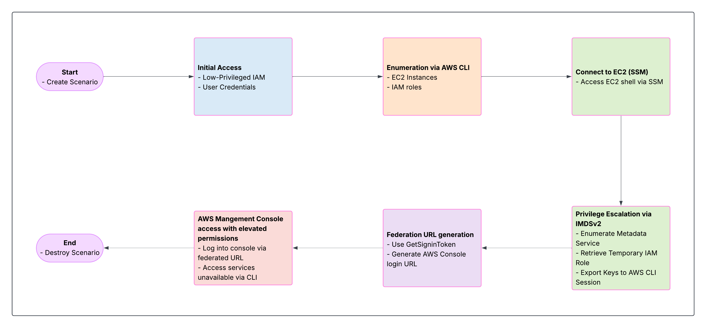

# Scenario: federated_console_takeover

**Size:** Medium

**Difficulty:** Moderate

**Command:** `./cloudgoat.py create federated_console_takeover`

## Scenario Resources

- 1 IAM User with limited permissions
- 1 EC2 instance with IMDSv2 enabled
- 1 IAM role with elevated permissions
- 1 VPC with public subnet

## Scenario Start(s)

1. AWS Access Key and Secret Key for a low-privileged IAM user

## Scenario Goal(s)

Pivot from limited CLI access to AWS Management Console with elevated permissions

## Summary

In this scenario, you are given AWS CLI credentials for a low-privileged IAM user. Your task is to enumerate AWS resources, gain access to an EC2 instance via SSM Session Manager, exploit the IMDSv2 metadata service to retrieve temporary credentials, and use those credentials to generate a federation URL that allows you to access the AWS Management Console with elevated permissions.

## Exploitation Route

## Attack Path Diagram

1. Configure AWS CLI with provided credentials
2. Enumerate EC2 instances and IAM roles
3. Access EC2 instance via SSM Session Manager
4. Exploit IMDSv2 to retrieve temporary credentials
5. Generate federation URL for console access

## Walkthrough - Federated Console Takeover

A detailed cheat sheet & walkthrough for this scenario is available [here](./cheat_sheet.md).

## Learning Objectives

- AWS CLI enumeration techniques
- EC2 instance metadata service (IMDSv2) exploitation
- AWS STS federation URL generation
- Privilege escalation via IAM role assumption
- Map techniques to MITRE ATT&CK (e.g., T1078.004, T1580, T1552.005)

## Cloud Security Topics Covered

- IAM permission boundaries and least privilege
- EC2 metadata service security
- AWS credential management and security
- Federation and temporary credential usage

## Real-World Relevance

This attack path mirrors techniques used in actual AWS breaches where attackers pivot from limited access to full console access by exploiting EC2 instance roles. Organizations should implement proper IAM configurations, enforce IMDSv2, and monitor for suspicious federation access to prevent such attacks.

Gaining AWS Console access is extremely useful for attackers. It allows them to blend in with legitimate user activity, evade detections designed for scripted CLI/API behavior, and interact with services more easily through the visual interface. While actions are still logged in CloudTrail, console access offers greater stealth, convenience, and visibility making post-exploitation far more effective. Additionally, certain capabilities like launching CloudShell or creating root account access keys are only possible through the console, further increasing its value to an attacker.

##  Mitigations for federated console takeover via IMDSv2

- Enforce IMDSv2 with hop limit = 1
  - Blocks indirect metadata access via SSRF or shell-based exploits. Be sure to review your environment before implementing, as this may affect ECS tasks, containerized apps, or agents that access IMDS indirectly.

- Limit EC2 instance role permissions
  - Apply least privilege avoid broad roles like AdministratorAccess.

- Restrict SSM access
  - Only allow ssm:StartSession to trusted users or roles.

- Monitor for credential exfiltration
  - Use GuardDuty and CloudTrail to detect unusual IMDS or federation activity.

- Disable sts:GetFederationToken unless needed
  - Prevents abuse for console access via temporary credentials.

- Use SCPs or permission boundaries
  - Contain lateral movement and privilege escalation across environments.