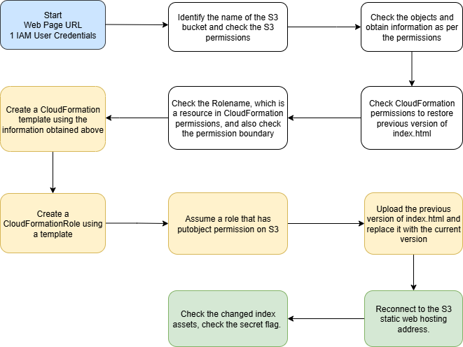

# Scenario: s3_version_rollback_via_cfn

**Size:** Small

**Difficulty:** Hard

**Command:** `$ ./cloudgoat.py create s3_version_rollback_via_cfn`

### Destroy Notice: Deletion will only be performed successfully if the S3 bucket is emptied directly.

## Scenario Resources

* 1 IAM User
* S3 x 1

## Scenario Start(s)

1 IAM User, 1 Public S3 website endpoint URL

## Scenario Goal(s)

Recover the previous version of `index.html` in the S3 static website and expose the hidden FLAG.

## Summary

Start with an S3 static website and a Web Manager IAM User. The attacker checks permissions to identify vulnerabilities in S3 versioning and object locking, and bypasses them to escalate privileges. Analyze permissions to restore previous versions of the page and get the "FLAG".

## Exploitation Route(s)

## Walkthrough - s3_version_rollback_via_cfn

1. The attacker accesses a publicly exposed static website hosted on S3. At first glance, it appears to be a simple landing page, but by analyzing the URL structure, they deduce that it's using S3 static website hosting.
2. By exploring the permissions associated with their IAM credentials, the attacker discovers that they have access to list objects and object versions within the S3 bucket.
3. The attacker finds that the `index.html` object exists in two versions, and the older version contains sensitive information.
4. The attacker has obtained the previous version of the file, but is unable to download the important flag file. Attacker realizes that he must restore it directly to the web page. But `PutObject` permission was Deny.
5. Upon analyzing the user's inline IAM policy and the applied permissions boundary, the attacker identifies that `cloudformation:CreateStack` is allowed and that the boundary policy includes permission for `s3:PutObject`.
6. Based on this, the user crafts a CloudFormation template to create a new IAM role with `s3:PutObject` permissions. Care is taken to ensure the role stays within the constraints of the permissions boundary.
7. The created role is configured to allow the user to assume it, and the attacker successfully obtains elevated privileges via `AssumeRole`.
8. With the new permissions, the attacker re-uploads the previously obtained `index.html`, effectively overwriting the current version with the previous one.
9. Upon revisiting the static website URL, the modified index page is now active, revealing the flag — completing the scenario.
10. This led to the realization that the combination of object locking and versioning was a meaningless security setting, and successfully exploits misconfigured inline policies and permission boundaries to achieve privilege escalation.

A cheat sheet for this route is available [here](./cheat_sheet.md).
