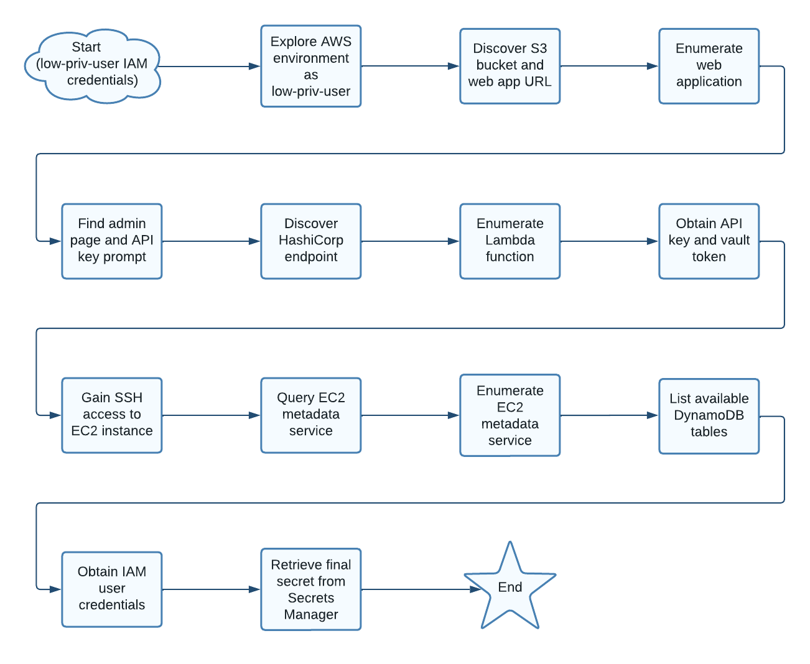

# Scenario: secrets_in_the_cloud

**Size:** Large

**Difficulty:** Hard

**Command:** `$ ./cloudgoat.py create secrets_in_the_cloud`

## Resources

* 1 Lambda
* 1 EC2
* 1 S3
* 1 DynamoDB
* 1 Secrets Manager Secret
* 2 IAM Users

## Start

1. IAM User: low-priv-user

## Goal

Find the final secret in Secrets Manager.

## Summary

As an IAM user with limited privileges, the attacker initiates their journey by examining AWS resources to uncover clues and hidden information. This investigation ultimately results in acquiring a role that grants access to the scenario's primary objective: retrieving the final secret from Secrets Manager. Please note that this walkthrough outlines the intended path for completing the scenario. However, alternative approaches may exist, and we would be delighted to learn about any unique methods used to reach the finish line.

## Path

## Walkthrough

1. As the IAM user "low-priv-user", the attacker explores the AWS environment, discovering an S3 bucket containing the URL to a web application hosted on an EC2 instance.
2. The attacker enumerates the web application and uncovers an admin page that prompts for an API key.
3. While examining the admin page's HTML comments, the attacker finds information about environment variables and a HashiCorp endpoint (located on port 8200 of the EC2 instance).
4. By enumerating the scenario's Lambda function, the attacker locates the web application's API key and uses it to obtain the HashiCorp vault token.
5. The attacker leverages the vault token to log in to the HashiCorp endpoint and acquires the id_rsa key, which grants SSH access to the EC2 instance hosting the web application.
6. Intrigued by the login message, the attacker queries the EC2 metadata service and discovers that IMDSv2 is in use.
7. The attacker queries the EC2 metadata service again, using a token in the header of the request to successfully obtain a response.
8. After enumerating the EC2 metadata service, the attacker decides to list available DynamoDB tables and discovers a table containing IAM user credentials specific to the scenario.
9. Utilizing the newly acquired IAM user credentials, the attacker retrieves the final secret from the Secrets Manager, successfully completing the scenario.

A cheat sheet for the scenario is available [here](./cheat_sheet.md).
