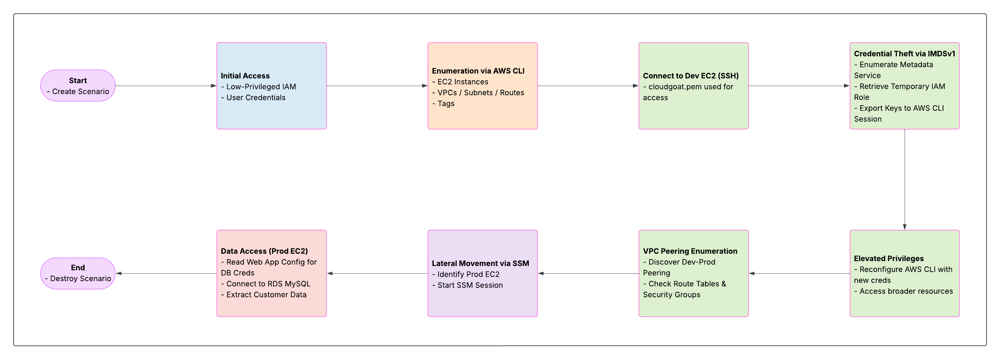

# Scenario: vpc_peering_overexposed

---

- Size: Medium
- Difficulty: Moderate
- Command: ./cloudgoat.py create vpc_peering_overexposed

## Scenario Resources

---

- 2 VPCs (Dev and Prod) with VPC Peering
- 2 EC2 instances (1 in Dev VPC, 1 in Prod VPC)
- 1 RDS MySQL instance (in Prod VPC)
- IAM Users, Roles, and Policies
- Security Groups and Route Tables
- SSM VPC Endpoints (in Prod VPC)
- S3 Gateway Endpoint (in Prod VPC)
- Web Server with insecure configuration files
- Database with mock PII data

## Scenario Start(s)

---

1. AWS Access Key and Secret Key for a low-privileged user & SSH key

## Scenario Goal(s)

---

Exploit a series of AWS misconfigurations:

1. Enumerate AWS environment

2. Access EC2 metadata to steal IAM credentials

3. Exploit VPC peering misconfigurations

4. Move laterally via SSM to Prod EC2

5. Access sensitive customer data in RDS

## Summary

---

In this scenario, you are given AWS credentials to a low-privileged user, simulating an assumed breach scenario. Your task is to enumerate the AWS environment, identify vulnerable EC2 instances, exploit the EC2 metadata service to gain higher privileges, take advantage of misconfigured VPC peering and security groups to pivot into a production environment which should have been segmented from Dev, and finally access sensitive PII data from an RDS MySQL database. 

This scenario is inspired by the 2021 data breach of a major TELCO company, where attackers exploited similar misconfigurations to gain unauthorized access to customer data. The breach resulted in the exposure of personal information belonging to approximately 50 million customers.

****Note: Some AWS CLI commands in this lab may appear redundant. This is intentional one of the learning objectives is to gain hands-on experience with AWS CLI enumeration techniques and become comfortable reading and interpreting raw JSON outputs. Understanding how to extract meaningful information from these responses is a critical skill in both offensive and defensive cloud security roles.****

## Exploitation Route

## Attack Path Steps:

---

1. Use initial IAM credentials to enumerate AWS resources

2. Connect to Dev EC2 via SSH (the instance has a public IP and SSH open to whitelisted IPs)

3. Exploit IMDSv1 to steal IAM credentials from the Dev EC2 instance

4. Use the stolen elevated credentials to discover Prod environment resources

5. Use SSM Session Manager with the elevated credentials to move laterally to Prod EC2

6. Discover database credentials in the web server configuration files

7. Access and view sensitive customer data

## TELCO Breach Relation

---

This scenario simulates several key aspects of a large TELCO breach in 2021:

1. Initial access to a development environment

2. Exploitation of IAM misconfigurations

3. Abuse of network segmentation weaknesses

4. Lateral movement to production systems

5. Access to customer PII data

**While simplified for educational purposes, the scenario teaches the same cloud security principles that could have prevented the actual breach.**

## Mitigation Strategies

---

1. Enforce IMDSv2 on all EC2 instances

2. Implement least privilege IAM policies

3. Properly segment networks with restrictive VPC peering

4. Implement stricter security group rules

5. Enable enhanced monitoring and logging

A detailed cheat sheet & walkthrough for this scenario is available [here](./cheat_sheet.md).