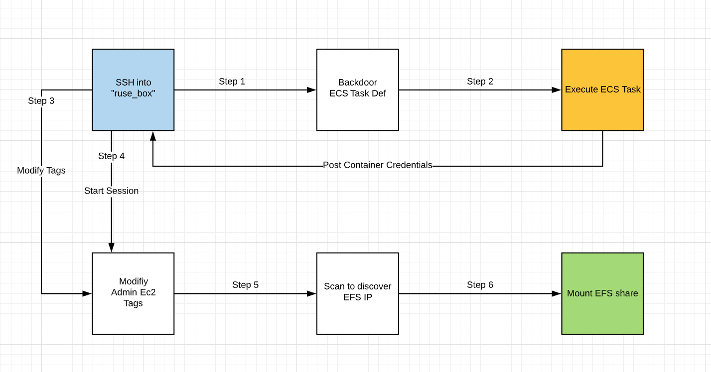

# Scenario: ecs_efs_attack

**Size:** Large

**Difficulty:** Hard

**Command:** `$ ./cloudgoat.py create ecs_efs_attack`

## Scenario Resources

- 1 VPC with:
	- EC2 x 2
	- 1 ECS Cluster
	- 1 ECS Service 
	- 1 EFS

## Scenario Start(s)

1. SSH access to "Ruse_Box" EC2

## Scenario Goal(s)

Mount the "cg-efs-[CG_ID]" efs and obtain the flag.

## Summary

Starting with access the "ruse" EC2 the user leverages the instace profile to backdoor the running ECS container. Using the backdoored container the attacker can retireve credentials from the container metadata API. These credentials allow the attacker to start a session on any EC2 with the proper tags set. The attacker uses their permissions to change the tags on the Admin EC2 and starts a session. Once in the Admin EC2 the attacker will port scan the subnet for an open EFS to mount. Once mounted the attacker can retrieve the flag from the elastic file system.

## Exploitation Route(s)

## Route Walkthrough 

1. Access the "Ruse_Box" ec2 using the provied access key.
2. From the ec2 enumate permission. Then list avaible ec2 and note how the tags are configured.
3. From the current ec2 enumate existing ecs cluster and backdoor the existing task defniniton.
4. Update the existing service in the ecs cluster to execute the payload.
5. From the container credentilas use the SSM:StartSession privlage to access the admin_box.
6. Port scan the subnet to find avaible efs and mount.

**A cheat sheet for this route is available [here](./cheat_sheet.md).**
