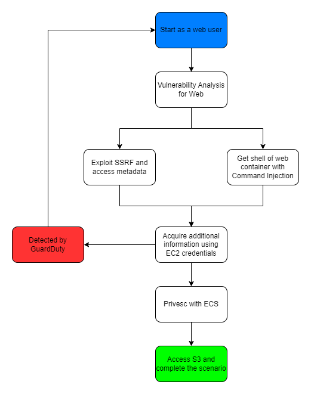

# Scenario: ecs_privesc_evade_protection

**Size**: Medium

**Difficulty**: Moderate

**Command**: `$ ./cloudgoat.py create guardduty_bypass_with_ecs`

## Scenario Resources

- 1 ECS with:
    - 1 * ASG with :
        - 1 * EC2
    - 1 * Service (web container)
- 2 * S3 (1 * secret, 1 * cloudtrail)
- Detection Mechanisms
  - GuardDuty enabled
  - CloudWatch
  - CloudTrail
  - EventBridge
  - Lambda
  - SES

## Scenario Start(s)

Scenario starts as a web user.

> **Warning**: If GuardDuty have enabled before creating scenario, It would cause an error.

## Scenario Goal(s)

Read flag.txt in S3 with avoiding various defense techniques.

## Summary

There is a very vulnerable website operating on AWS. The site's security administrator became frightened and took some web security measures and enabled GuardDuty for EC2's credentials. Take a detour and approach S3 and win the secret string.

## Email setup
 
- If AWS Guard Duty detects your attack in the scenario, we will send you an email. So you need to register an email and respond to AWS authentication mail sent to that email before start.
- If you prefer not to use a standard email address, you might consider services such as https://temp-mail.org/ or https://www.fakemail.net/.

# SPOILER ALERT: There are spoilers for the scenario blew this point.

## Exploitation Route

## Scenario Walk-through

### Easy Path
- Attacker accesses the web service of a container inside EC2 managed by ECS.
- The attacker exploits vulnerabilities in a web service to access the EC2's credentials or take control of the container.
- The attacker accesses S3. Gets the Secret String in `flag.txt` and exits the scenario.

### Hard Path
- Attacker accesses the web service of a container inside EC2 managed by ECS.
- The attacker exploits vulnerabilities in a web service to access the EC2's credentials or take control of the container.
- The attacker defines and executes an ECS task with the authority of the web developer to privesc or bypass mitigations. Perform a reverse shell attack to access the container been created.
- The attacker accesses S3 at the container to bypass GuardDuty detection. Gets the Secret String in `secret-string.txt` and exits the scenario.

