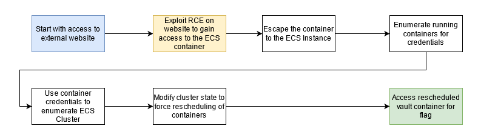

# Scenario: ecs_takeover

**Size:** Medium

**Difficulty:** Moderate

**Command:** `$ ./cloudgoat.py create ecs_takeover`

## Scenario Resources

- 1 VPC and Subnet with:
    - 2 EC2 Instances
    - 1 ECS Cluster
    - 3 ECS Services
    - 1 Internet Gateway

## Scenario Start(s)

1. Access the external website via the EC2 Instance's public IP.

## Scenario Goal(s)

Gain access to the "vault" container and retrieve the flag.

## Summary

Starting with access to the external website the attacker needs to find a remote code execution vulnerability. Through
this the attacker can take advantage of resources available to the container hosting the website. The attacker discovers
that the container has access to the host's metadata service and role credentials. They also discover the Docker socket
mounted in the container giving full unauthenticated access to Docker on one host in the cluster. Abusing the mount
misconfiguration, the attacker can enumerate other running containers on the instance and compromise the container role
of a semi-privileged privd container. Using the privd role the attacker can enumerate the nodes and running tasks across
the ECS cluster where another task "vault" is discovered to be running on a second node. With the host container
privileges gained earlier, the attacker modifies the state of the cluster and forces ECS to reschedule the container to
the compromised host. This allows the attacker to access the flag stored in the root of the "vault" container instance
through docker.

## Exploitation Route(s)

## Route Walkthrough 

1. Access the website using the provided URL.
2. Exploit code injection vulnerability to execute commands in the website container.
3. Search for available AWS credentials.
  a. Obtain the AWS credentials from the container instance's (the host's) metadata service.
  b. Leverage the docker socket mounted in the website container to retrieve AWS credentials from the "privd" container.
5. Use the "privd" container role to find the other worker nodes and the "vault" task.
6. Using IAM privileges of the container instance node, deregister or drain the other worker instance.
7. Wait for the "vault" container to be rescheduled and deployed to the attacker's worker instance.

## Additional Information

Https://ruse.tech/blogs/ecs-attack-methods

**A cheat sheet for this route is available [here](./cheat_sheet.md).**
