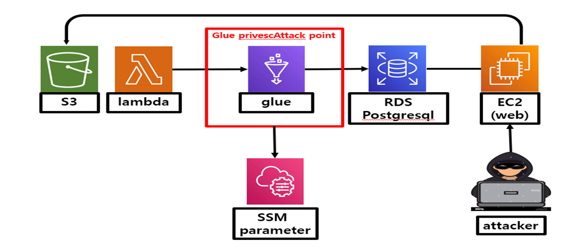
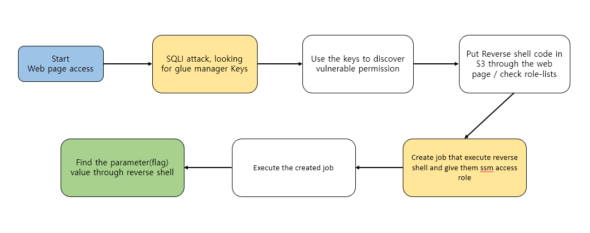

# Scenario : Glue_privesc

**Size:** Large

**Difficulty:** Moderate

**Command:** `$ ./cloudgoat.py create glue_privesc`

## Scenario Resources

- 1 VPC with:
    - S3  x 1
    - RDS x1
    - EC2 x1
    - Glue service
- Lambda x1
- SSM parameter Store
- IAM Users x 2

## Scenario Start(s)

Web address

## Scenario Goal(s)

Find a secret string stored in the ssm parameter store

## Summary

There is an environment that is implemented as shown in the schematic drawing below. Glue service manager will accidentally upload their access keys through the web page. The manager hurriedly deleted the key from s3, but does not recognize that the key was stored in the DB.

Find the manager's key and access the ssm parameter store with a vulnerable permission to find the parameter value named “flag”.

> *Note*: The web page and the glue ETL job used in this scenario require some latency. The web page requires 1 minute after applying, and Glue requires 3 minutes after uploading the file. If the data file is not applied properly, please wait a little longer!

## Schematic drawing

## Exploitation Route(s)

## Route Walkthrough

※ The attacker identifies the web page functionality first. When you upload a file, it is stored in a specific s3, and you can see that the data in that file is applied to the monitoring page.

1. The attacker steals the Glue manager's access key and secret key through a SQL Injection attack on the web page.
2. The attacker checks the policies and permissions of the exposed account to identify any vulnerable privileges. Through these privileges, the attacker discovers the ability to create and execute a job that can perform a reverse shell attack, enabling them to obtain the desired role simultaneously.
3. List the roles to use "iam:passrole," write the reverse shell code, and insert this code file (.py) into S3 through the web page.
4. In order to gain SSM access, Perform the creation of a Glue service job via AWS CLI, which also executes the reverse shell code.
5. Execute the created job.
6. Extract the value of “flag”(parameter name) from the ssm parameter store.

**A cheat sheet for this route is available [here](./cheat_sheet.md)**
