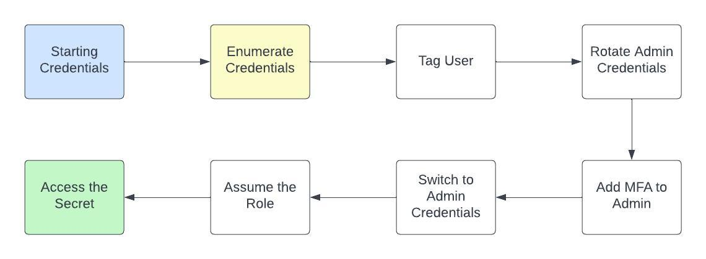

# Scenario: iam_privesc_by_key_rotation

**Size:** Small  
**Difficulty:** Easy

**Command:** `./cloudgoat.py create iam_privesc_by_key_rotation`

## Scenario Resources

- 3 IAM User
- 1 IAM Role
- 1 Secret

## Scenario Start(s)

1. IAM User "manager"

## Scenario Goal(s)

Retrieve AWS secret

## Summary

Exploit insecure IAM permissions to escalate your access. Start with a role that manages other users credentials and find a weakness in the setup to access the "admin" role. Using the admin role retrieve the flag from secretsmanager.

## Walkthrough & Exploitation Routes

  
Spoiler warning

  
  1. Starting with the manager user add a tag to the admin user
  2. Delete and add a new access key to the admin user
  3. Create and attach a MFA device to the admin user
  4. Switch to the admin user
  5. Assume the secretsmanager role with MFA
  6. Retrieve the secret

  A full cheat_sheet can be found [here](./cheat_sheet.md)

    

