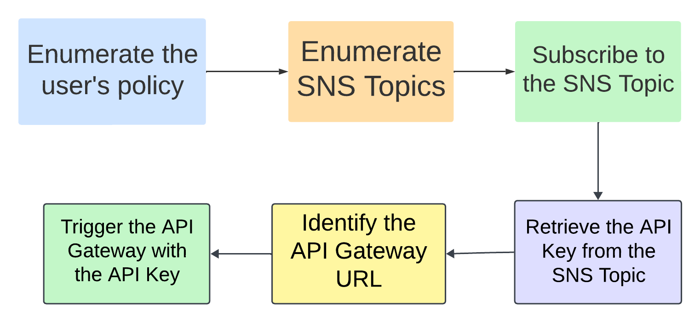

# Scenario: sns_secrets

**Size:** Small

**Difficulty:** Easy

**Command:** `$ ./cloudgoat.py create sns_secrets`

## Scenario Resources

- 1 EC2 instance
- 1 SNS topic
- 1 API Gateway REST API
- 1 IAM role
- 1 IAM user

## Scenario Start(s)

1. AWS Access Key and Secret Key

## Scenario Goal(s)

Get the final flag by invoking the API Gateway with the leaked API key.

## Summary

In this scenario, you are provided with AWS credentials. You need to enumerate permissions and realize you have permissions to list and subscribe to SNS topics. Use Pacu's new modules "sns__enum" and "sns__subscribe" to subscribe to the topic. You will receive an email from the topic with an API Key as a debug message. Then, use the AWS CLI to enumerate the API Gateways to find the API Gateway path, method, stage, and resource. Finally, do a curl request with the API key to get the final flag.

## Exploitation Route

## Walkthrough - SNS Secrets

1. Start by enumerating the permissions of the provided AWS access key and secret key.
2. Enumerate SNS topics using the `sns__enum` module in Pacu to list the available topics.
3. Subscribe to the identified SNS topic using the `sns__subscribe` module in Pacu.
4. Confirm the subscription via the email you receive.
5. Wait for the SNS topic to publish messages and check your email for a message containing an API Key.
6. Enumerate API Gateways using the AWS CLI to find the API Gateway path, method, stage, and resource.
7. Identify the correct method and stage for the API Gateway.
8. Use `curl` with the API Key to invoke the API Gateway and retrieve the final flag.

A detailed cheat sheet & walkthrough for this route is available [here](./cheat_sheet.md). 
