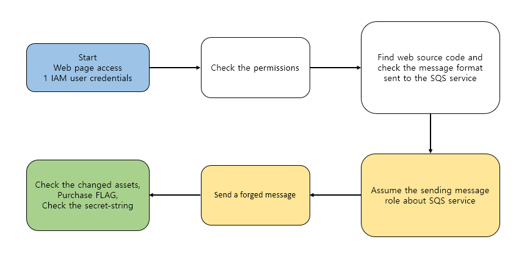

# Scenario : SQS_FLAG_Shop

**Size:** Medium
**Difficulty:** Easy

**Command:** `$ ./cloudgoat.py create sqs_flag_shop`

### Scenario Resources

- 1 VPC with:
    - Lambda  x 1
    - RDS x1
    - EC2 x1
- SQS
- IAM Users x 1

### Scenario Start(s)

1 IAM User, Web address

## Scenario Goal(s)

Buy FLAG successfully on the shop site

## Summary

The first web page will be provided. Attackers check the privileges they currently have and perform privilege escalation. Find and analyze the hidden web source code, and think about how you can buy “FLAG” using the privileges you have!

## Exploitation Route(s)

## Route Walkthrough

1. The attacker accesses the web page and identifies the features first
2. The attacker checks the privileges it has
3. Find the web source code. By analyzing the source code, the attacker checks the format of message sent to the SQS service
4. Assume the the sending message role about SQS service
5. The attacker, who possesses the necessary permissions, sends a forged message to the SQS service queue
6. Check the changed assets, purchase FLAG and check the secret-string

**A cheat sheet for this route is available [here](cheat_sheet.md)**
