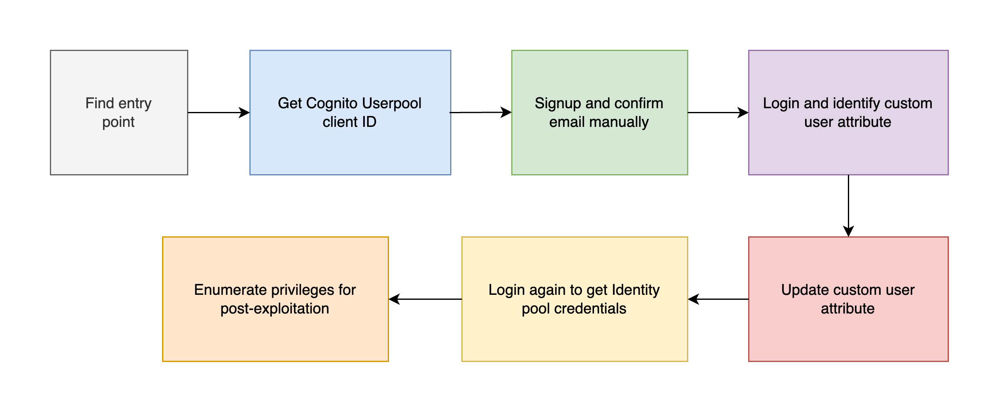

# Scenario: vulnerable_cognito

**Size:** Small

**Difficulty:** Moderate

**Command:** `$ ./cloudgoat.py create vulnerable_cognito`

## Scenario Resources

- 1 S3 bucket
- 1 Cognito Userpool
- 1 Cognito IdentityPool
- 1 API Gateway REST API
- 1 Lambda
- 1 IAM role

## Scenario Start(s)

1. API Gateway URL

## Scenario Goal(s)

Get Cognito IdentityPool credentials.

## Summary

In this scenario, you are presented with a signup and login page with AWS Cognito in the backend.
You need to bypass restrictions and exploit misconfigurations in Amazon Cognito in order to
elevate your privileges and get Cognito Identity Pool credentials.

## Exploitation Route(s)

## Walkthrough - Vulnerable Cognito

0. Visit the link generated by the 'cloudgoat create vulnerable_cognito' in a browser. It's called 'apigateway_url'.
1. Starting with a Login and Signup form, the attacker tries to signup using an email but receives an email validation error.
2. The attacker opens source code of webpage to get Cognito Userpool client ID.
3. The attacker then uses AWS CLI to sign up and confirm email manually to bypass client-side validation check for the email.
4. Attacker logs in and gets redirected to "reader.html" webpage which does not contain any useful information. In Burp Suite, attacker finds a custom user attribute added after email confirmation.
5. The attacker then updates the custom attribute value using AWS CLI to escalate privileges.
6. Attacker logs in again and finds an Identity Pool session being established in Burp Suite which contains AWS Access keys in response.
7. Attacker collects the credentials and runs enumerate-iam script to check privileges.

A cheat sheet for this route is available [here](./cheat_sheet.md).
